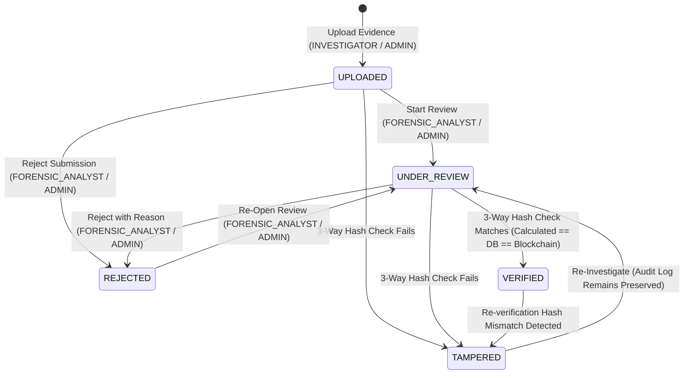

# Evidence Status Workflow Documentation

This document describes the design, lifecycle, authorization rules, and testing procedures for **Feature 2: Evidence Status Workflow** in the **Blockchain-Based Digital Evidence Verification System**.

---

## 1. Evidence Lifecycle Diagram

---

## 2. Status Definitions

1. **`UPLOADED`**
   - Default initial state assigned upon successful evidence upload and Polygon blockchain anchoring.

2. **`UNDER_REVIEW`**
   - Active examination state initiated by a `FORENSIC_ANALYST` or `ADMIN`.

3. **`VERIFIED`**
   - State set when 3-way hash verification passes (`Calculated SHA-256 == PostgreSQL Stored Hash == Polygon Blockchain Anchor`).

4. **`REJECTED`**
   - Administrative rejection state assigned when evidence is rejected due to invalid metadata, duplicate submission, or policy violation. Requires a mandatory non-empty rejection reason.

5. **`TAMPERED`**
   - Critical alert state assigned automatically whenever a 3-way hash integrity check fails. Original evidence hashes and on-chain records are never modified.

---

## 3. Valid vs. Invalid Status Transitions

### Valid Transitions
- `UPLOADED -> UNDER_REVIEW` (Start forensic examination)
- `UPLOADED -> REJECTED` (Reject invalid submission directly)
- `UNDER_REVIEW -> VERIFIED` (3-Way hash match success)
- `UNDER_REVIEW -> REJECTED` (Reject during review with reason)
- `UNDER_REVIEW -> TAMPERED` (3-Way hash mismatch detected)
- `VERIFIED -> TAMPERED` (Re-verification hash mismatch detected)
- `REJECTED -> UNDER_REVIEW` (Re-open for review)
- `TAMPERED -> UNDER_REVIEW` (Re-open for forensic re-investigation)

### Invalid Transitions (Rejected by Backend with HTTP 400)
- `VERIFIED -> UPLOADED` ❌
- `TAMPERED -> VERIFIED` directly ❌ (Must go through `UNDER_REVIEW` and re-verification)
- `REJECTED -> VERIFIED` directly ❌

---

## 4. Role Permission Matrix for Workflow Actions

| Workflow Action | ADMIN | FORENSIC_ANALYST | INVESTIGATOR | VIEWER |
|---|:---:|:---:|:---:|:---:|
| **Upload Evidence (`status = UPLOADED`)** | ✅ | ❌ (403) | ✅ | ❌ (403) |
| **Start Review (`status = UNDER_REVIEW`)** | ✅ | ✅ | ❌ (403) | ❌ (403) |
| **Verify Integrity (`status = VERIFIED` / `TAMPERED`)** | ✅ | ✅ | ✅ | ❌ (403) |
| **Reject Evidence (`status = REJECTED`)** | ✅ | ✅ | ❌ (403) | ❌ (403) |
| **View Workflow Status & History** | ✅ | ✅ | ✅ | ✅ |

---

## 5. API Endpoints

| Method & Path | Security Rule | Description |
|---|---|---|
| `POST /api/evidence/upload` | `hasAnyRole('ADMIN', 'INVESTIGATOR')` | Upload evidence (sets status to `UPLOADED`) |
| `POST /api/evidence/{id}/review/start` | `hasAnyRole('ADMIN', 'FORENSIC_ANALYST')` | Transition status to `UNDER_REVIEW` |
| `POST /api/evidence/{id}/reject` | `hasAnyRole('ADMIN', 'FORENSIC_ANALYST')` | Transition status to `REJECTED` (Body: `{"reason": "..."}`) |
| `POST /api/evidence/verify` | `hasAnyRole('ADMIN', 'INVESTIGATOR', 'FORENSIC_ANALYST')` | Verify file (sets status to `VERIFIED` or `TAMPERED`) |
| `GET /api/evidence/{id}/status-history` | `hasAnyRole('ADMIN', 'INVESTIGATOR', 'FORENSIC_ANALYST', 'VIEWER')` | Get chain of custody workflow audit logs |

---

## 6. Database Schema & Migration Strategy

### New Database Columns on `evidence` Table
- `status`: `VARCHAR(255)` (Default: `'UPLOADED'`)
- `rejection_reason`: `VARCHAR(1000)`
- `review_started_at`: `TIMESTAMP`
- `reviewed_at`: `TIMESTAMP`
- `reviewed_by`: `VARCHAR(255)`
- `uploaded_at`: `TIMESTAMP`

### Migration Strategy (`DataInitializer`)
- Automatically populates `status = 'UPLOADED'` for any pre-existing evidence records that lack a status value upon system boot.

---

## 7. TAMPERED vs. Technical Error Distinction

- **Integrity Hash Mismatch (`TAMPERED`)**:
  - Occurs when calculated hash != stored hash OR database hash != blockchain hash.
  - Evidence status automatically becomes `TAMPERED`.
  - Immutable audit record `EVIDENCE_TAMPERED` is generated.
  - Original stored hashes and blockchain references remain unchanged.

- **Technical Failure (System Error)**:
  - Occurs when RPC connection fails, network times out, or database connection drops.
  - Evidence status remains **UNCHANGED** (does NOT become `TAMPERED`).
  - Returns appropriate technical error message to user.

---

## 8. Testing Instructions

1. **Test Start Review & Verification**:
   - Log in as `admin@example.com` / `Admin123!`.
   - Upload evidence file -> Status: `UPLOADED`.
   - Click "Start Review" -> Status: `UNDER_REVIEW`.
   - Click "Verify File Integrity" with matching file -> Status: `VERIFIED`.

2. **Test Evidence Rejection**:
   - Upload evidence -> Status: `UPLOADED`.
   - Click "Reject Evidence" -> Enter reason "Duplicate submission" -> Status: `REJECTED`. Audit log records rejection rationale.

3. **Test Tampered Flagging**:
   - Perform verification using a modified/tampered file -> Status becomes `TAMPERED`. Alert banner renders in red on Evidence Details page.

4. **Test Investigator & Viewer Authorization Limits**:
   - Log in as an `INVESTIGATOR` or `VIEWER`.
   - Attempt calling `POST /api/evidence/{id}/reject` or `POST /api/evidence/{id}/review/start` -> Returns **HTTP 403 Forbidden**.
