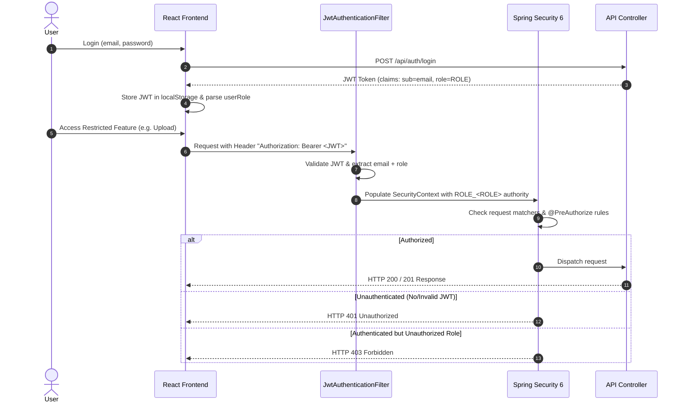

# Role-Based Access Control (RBAC) Documentation

This document describes the implementation, configuration, and testing procedures for **Role-Based Access Control (RBAC)** in the **Blockchain-Based Digital Evidence Verification System**.

---

## 1. Available Roles

The system defines four standardized authorization roles:

1. **`ADMIN`**
   - Full system access, governance, evidence operations, and user role management.
   - Converted internally to authority: `ROLE_ADMIN`.

2. **`INVESTIGATOR`**
   - Submits and investigates digital evidence.
   - Uploads evidence, verifies evidence, views authorized evidence records, audit trails, and blockchain statuses.
   - Converted internally to authority: `ROLE_INVESTIGATOR`.

3. **`FORENSIC_ANALYST`**
   - Examines and verifies evidence integrity.
   - Views evidence records, verifies evidence files against database and blockchain, views audit trails and blockchain records.
   - Converted internally to authority: `ROLE_FORENSIC_ANALYST`.

4. **`VIEWER`**
   - Read-only observer access.
   - Views permitted evidence, evidence details, verification statuses, and blockchain anchoring records.
   - Converted internally to authority: `ROLE_VIEWER`.

---

## 2. Permission Matrix

| Operation / Feature | ADMIN | INVESTIGATOR | FORENSIC_ANALYST | VIEWER |
|---|:---:|:---:|:---:|:---:|
| **View Dashboard** | ✅ | ✅ | ✅ | ✅ |
| **View Evidence Records** | ✅ (All) | ✅ (Own/Auth) | ✅ (All) | ✅ (All) |
| **View Evidence Details** | ✅ (All) | ✅ (Own/Auth) | ✅ (All) | ✅ (All) |
| **Upload New Evidence** | ✅ | ✅ | ❌ (403) | ❌ (403) |
| **Verify Evidence File** | ✅ | ✅ | ✅ | ❌ (403) |
| **View Audit Trail** | ✅ | ✅ | ✅ | ✅ |
| **View Blockchain Record** | ✅ | ✅ | ✅ | ✅ |
| **View System Users** (`GET /api/admin/users`) | ✅ | ❌ (403) | ❌ (403) | ❌ (403) |
| **Modify User Roles** (`PUT /api/admin/users/{id}/role`) | ✅ | ❌ (403) | ❌ (403) | ❌ (403) |
| **Direct Hash/Blockchain Modification** | ❌ | ❌ | ❌ | ❌ |

---

## 3. Authentication & Authorization Flow



---

## 4. API Authorization Rules

| Endpoint Method & Path | Spring Security Protection Rule | Roles Allowed |
|---|---|---|
| `POST /api/auth/register` | `permitAll()` | Public |
| `POST /api/auth/login` | `permitAll()` | Public |
| `GET /api/auth/verify-email` | `permitAll()` | Public |
| `POST /api/auth/resend-verification` | `permitAll()` | Public |
| `GET /api/test/secure` | `authenticated()` | All Authenticated |
| `POST /api/evidence/upload` | `hasAnyRole('ADMIN', 'INVESTIGATOR')` | ADMIN, INVESTIGATOR |
| `POST /api/evidence/verify` | `hasAnyRole('ADMIN', 'INVESTIGATOR', 'FORENSIC_ANALYST')` | ADMIN, INVESTIGATOR, FORENSIC_ANALYST |
| `GET /api/evidence` | `hasAnyRole('ADMIN', 'INVESTIGATOR', 'FORENSIC_ANALYST', 'VIEWER')` | All Authenticated |
| `GET /api/evidence/{evidenceId}` | `hasAnyRole('ADMIN', 'INVESTIGATOR', 'FORENSIC_ANALYST', 'VIEWER')` | All Authenticated |
| `GET /api/evidence/{evidenceId}/audit-logs` | `hasAnyRole('ADMIN', 'INVESTIGATOR', 'FORENSIC_ANALYST', 'VIEWER')` | All Authenticated |
| `GET /api/evidence/{evidenceId}/blockchain` | `hasAnyRole('ADMIN', 'INVESTIGATOR', 'FORENSIC_ANALYST', 'VIEWER')` | All Authenticated |
| `GET /api/admin/users` | `hasRole('ADMIN')` | ADMIN |
| `PUT /api/admin/users/{id}/role` | `hasRole('ADMIN')` | ADMIN |

---

## 5. Database Schema & Migration Strategy

### Database Changes
- The `users` table uses the existing column `role` (`VARCHAR(255)`).
- Valid values stored in database: `'ADMIN'`, `'INVESTIGATOR'`, `'FORENSIC_ANALYST'`, `'VIEWER'`.

### Automated Startup Migration (`DataInitializer`)
- Automatically executed on application boot via Spring Boot's `CommandLineRunner`.
- Any existing database rows with legacy role values (`null`, `''`, or `'VERIFIER'`) are safely migrated to `'INVESTIGATOR'`.
- Validates that an active `ADMIN` account exists. If no admin account is found, it automatically provisions `admin@example.com` (Default Password: `Admin123!`, Role: `ADMIN`, Email Verified: `true`).

---

## 6. Testing Guide for Each Role

### Seed Accounts (Created by DataInitializer or via Registration)
- **Admin**: `admin@example.com` / `Admin123!`
- **Investigator**: Register via `/register` (defaults to `INVESTIGATOR`).
- **Forensic Analyst**: Promoted by Admin via User Management.
- **Viewer**: Promoted by Admin via User Management.

### Testing 401 Unauthorized vs. 403 Forbidden

1. **Testing HTTP 401 Unauthorized**:
   ```bash
   # Make a request without Authorization header
   curl -i http://localhost:8080/api/evidence
   # Expected Output: HTTP/1.1 401 Unauthorized
   ```

2. **Testing HTTP 403 Forbidden (Role Enforcement)**:
   ```bash
   # Log in as a VIEWER to get JWT token
   # Attempt to call Upload evidence API using VIEWER token
   curl -i -X POST http://localhost:8080/api/evidence/upload \
     -H "Authorization: Bearer <VIEWER_JWT_TOKEN>" \
     -F "file=@sample.pdf"
   # Expected Output: HTTP/1.1 403 Forbidden
   # JSON: {"error":"Access Denied: You do not have permission to access this resource."}
   ```

3. **Testing Admin Endpoints Protection**:
   ```bash
   # Attempt to access user management as an INVESTIGATOR
   curl -i http://localhost:8080/api/admin/users \
     -H "Authorization: Bearer <INVESTIGATOR_JWT_TOKEN>"
   # Expected Output: HTTP/1.1 403 Forbidden
   ```

4. **Testing Last Admin Demotion Safeguard**:
   ```bash
   # Log in as ADMIN and attempt to demote yourself when you are the sole ADMIN
   curl -i -X PUT http://localhost:8080/api/admin/users/1/role \
     -H "Authorization: Bearer <ADMIN_JWT_TOKEN>" \
     -H "Content-Type: application/json" \
     -d '{"role": "VIEWER"}'
   # Expected Output: HTTP/1.1 400 Bad Request
   # JSON: {"error":"Cannot demote the last remaining ADMIN user."}
   ```
